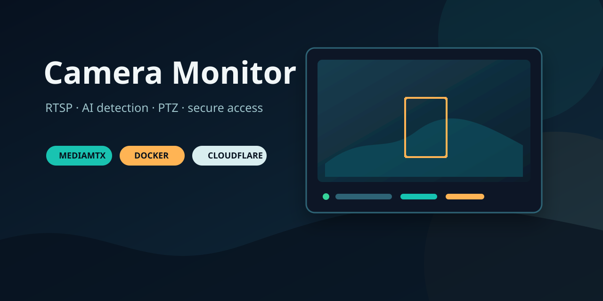
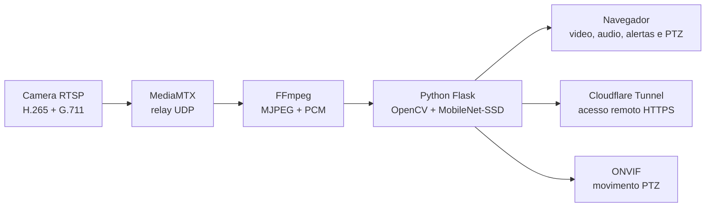

# Camera Monitor

> Monitoramento RTSP com deteccao de pessoas e animais, audio da camera, alertas e controle PTZ em uma interface web protegida.



[](https://www.docker.com/)
[](https://www.python.org/)
[](https://github.com/bluenviron/mediamtx)
[](https://github.com/plugato/camera-monitor/actions/workflows/ci.yml)

**Documentacao:** [seguranca](SECURITY.md) · [como contribuir](CONTRIBUTING.md) · [changelog](CHANGELOG.md)

O Camera Monitor transforma o stream RTSP da camera em um painel web pratico para acompanhar a cena, ouvir o audio, receber notificacoes e mover uma camera PTZ.

## O que ele faz

- Recebe video H.265 e audio G.711 da camera via RTSP.
- Usa MediaMTX como relay para lidar com a negociacao RTSP da camera.
- Converte o video para MJPEG e analisa os frames com MobileNet-SSD.
- Detecta pessoas e animais com limiar de confianca configuravel no codigo.
- Desenha as deteccoes no stream e registra fotos dos alertas.
- Envia notificacoes desktop no Linux e no Windows.
- Reproduz o audio da camera pelo navegador.
- Controla o eixo horizontal e vertical da camera via ONVIF/PTZ.
- Protege o painel com usuario e senha HTTP Basic.
- Pode publicar o painel por um Cloudflare Tunnel dentro do Docker.

## Arquitetura



O fluxo principal fica dentro de um container. O MediaMTX e o monitor Python compartilham a rede interna do container; o Cloudflare Tunnel fica em um container separado e publica apenas a porta web do monitor.

## Requisitos

- Docker Engine
- Docker Compose v2
- Uma camera RTSP com ONVIF para PTZ
- Credenciais RTSP e ONVIF da camera
- Token de execucao de um Cloudflare Tunnel, caso o acesso remoto seja necessario

## Configuracao

Crie o arquivo de ambiente:

```bash
cp .env.exemplo .env
```

Preencha os valores:

```env
CAM_HOST=192.168.1.100
CAM_USER=usuario_rtsp
CAM_PASS=senha_rtsp
CAM_RTSP_PORT=554
CAM_ONVIF_PORT=5000
CAM_PATH=onvif1

APP_USER=admin
APP_PASS=use-uma-senha-longa-e-unica

CLOUDFLARE_TUNNEL_TOKEN=token-do-tunel
```

O arquivo `.env` e ignorado pelo Git. Nunca coloque credenciais diretamente em `compose.yaml`, no codigo ou em commits.

## Executar

Suba toda a stack:

```bash
./start.sh
```

Ou use o Compose diretamente:

```bash
docker compose up -d --build
docker compose ps
```

Painel local:

```text
http://localhost:8090
```

A aplicacao exige `APP_USER` e `APP_PASS`. O endpoint `/healthz` fica disponivel apenas para o healthcheck interno do Docker.

## Cloudflare Tunnel

O servico `cloudflared` usa o token definido em `CLOUDFLARE_TUNNEL_TOKEN` e publica o destino interno `camera-monitor:8090`.

No painel da Cloudflare, associe um Public Hostname ao tunnel:

- Subdominio: `camera`
- Dominio: seu dominio Cloudflare
- Servico: `HTTP`
- URL: `camera-monitor:8090`

Para exigir uma conta ou e-mail especifico, configure tambem uma aplicacao em **Zero Trust > Access > Applications**. A autenticacao Basic da aplicacao continua sendo uma segunda camada independente.

## Controle PTZ

A interface possui quatro direcoes:

- esquerda e direita: pan
- cima e baixo: tilt

O endpoint usado pela interface e:

```text
POST /ptz/<direcao>
```

Exemplo:

```bash
curl -u admin:senha -X POST http://localhost:8090/ptz/cima
```

A camera precisa aceitar o endpoint ONVIF configurado em `ptz.py`. O firmware pode limitar o tilt mesmo quando aceita o comando.

## Endpoints uteis

| Endpoint | Funcao |
| --- | --- |
| `/` | Painel web |
| `/stream` | Stream MJPEG anotado |
| `/audio` | Audio PCM da camera |
| `/status` | Estado, deteccoes e eventos |
| `/healthz` | Healthcheck interno |
| `/test` | Notificacao de teste |
| `/ptz/<direcao>` | Movimento PTZ |
| `/fotos/<nome>` | Fotos dos alertas |

Todos os endpoints, exceto `/healthz`, exigem autenticacao Basic.

## Operacao e diagnostico

Ver logs:

```bash
docker compose logs -f camera-monitor
docker compose logs -f cloudflared
```

Verificar a camera:

```bash
docker compose ps
curl -u "$APP_USER:$APP_PASS" http://localhost:8090/status
```

Parar a stack:

```bash
docker compose down
```

Se o monitor estiver `connected: false`, confira nesta ordem:

1. Host, porta, caminho e credenciais no `.env`.
2. Alcance da camera a partir do host Docker.
3. Logs do MediaMTX no container `camera-monitor`.
4. Perdas de pacotes UDP na rede local.
5. Se a camera aceita apenas uma sessao RTSP simultanea.

## Testes

Validar sintaxe:

```bash
python3 -m py_compile server.py config.py ptz.py
bash -n start.sh start-mediamtx.sh
```

O teste de deteccao usa fotos de referencia privadas em `fotos/` ou `teste/`, quando disponiveis:

```bash
python3 test_detect.py
```

## Estrutura

```text
server.py                 Aplicacao Flask, stream, deteccao, audio e PTZ
ptz.py                    Cliente ONVIF para movimento da camera
Dockerfile                Imagem do monitor com FFmpeg e MediaMTX
compose.yaml              Monitor e Cloudflare Tunnel
docker-entrypoint.sh      Inicializa MediaMTX e o servidor Python
.env.exemplo              Modelo de configuracao local
fotos/                    Fotos privadas dos eventos
MobileNetSSD_deploy.*     Modelo MobileNet-SSD e configuracao Caffe
```

## Seguranca

- Mantenha `.env`, tokens Cloudflare, fotos e logs fora do Git.
- Use uma senha forte e exclusiva em `APP_PASS`.
- Prefira Cloudflare Access para restringir o dominio a usuarios autorizados.
- Revogue tokens que tenham sido compartilhados em chats, terminais ou commits antigos.
