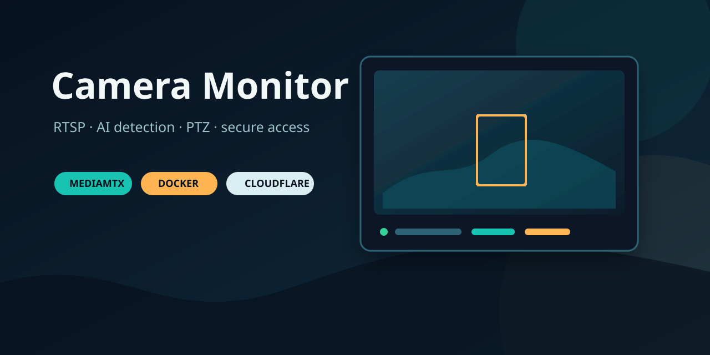
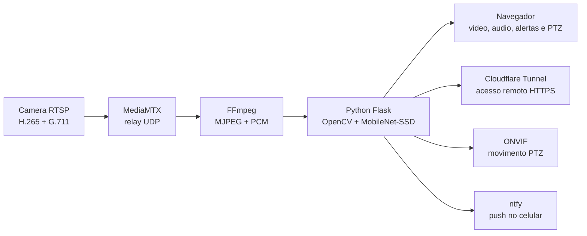

# Camera Monitor

> Monitoramento RTSP com deteccao de pessoas e animais, audio da camera, alertas e controle PTZ em uma interface web protegida.



[](https://www.docker.com/)
[](https://www.python.org/)
[](https://github.com/bluenviron/mediamtx)
[](https://github.com/plugato/camera-monitor/actions/workflows/ci.yml)

**Documentacao:** [seguranca](SECURITY.md) · [como contribuir](CONTRIBUTING.md) · [changelog](CHANGELOG.md)

O Camera Monitor transforma o stream RTSP da camera em um painel web pratico para acompanhar a cena, ouvir o audio, receber notificacoes e mover uma camera PTZ.

## O que ele faz

- Recebe video H.265 e audio G.711 da camera via RTSP.
- Usa MediaMTX como relay para lidar com a negociacao RTSP da camera.
- Converte o video para MJPEG e analisa os frames com MobileNet-SSD.
- Detecta pessoas e animais com limiar de confianca configuravel no codigo.
- Desenha as deteccoes no stream e registra fotos dos alertas.
- Envia notificacoes desktop no Linux e no Windows.
- Envia push para o celular (app ntfy) com a foto do alerta e link para o ao vivo.
- Reproduz o audio da camera pelo navegador.
- Controla o eixo horizontal e vertical da camera via ONVIF/PTZ.
- Protege o painel com usuario e senha HTTP Basic.
- Pode publicar o painel por um Cloudflare Tunnel dentro do Docker.
- Roda sozinho num Raspberry Pi 3 na rede da camera, sem PC ligado.

## Arquitetura


```mermaid
flowchart LR
    C[Camera RTSP\nH.265 + G.711] --> M[MediaMTX\nrelay UDP]
    M --> F[FFmpeg\nMJPEG + PCM]
    F --> P[Python Flask\nOpenCV + MobileNet-SSD]
    P --> B[Navegador\nvideo, audio, alertas e PTZ]
    P --> T[Cloudflare Tunnel\nacesso remoto HTTPS]
    P --> O[ONVIF\nmovimento PTZ]
    P --> N[ntfy\npush no celular]
```

O fluxo principal fica dentro de um container. O MediaMTX e o monitor Python compartilham a rede interna do container; o Cloudflare Tunnel fica em um container separado e publica apenas a porta web do monitor.

## Requisitos

- Docker Engine
- Docker Compose v2
- Uma camera RTSP com ONVIF para PTZ
- Credenciais RTSP e ONVIF da camera
- Token de execucao de um Cloudflare Tunnel, caso o acesso remoto seja necessario

## Configuracao

Crie o arquivo de ambiente:

```bash
cp .env.exemplo .env
```

Preencha os valores:

```env
CAM_HOST=192.168.1.100
CAM_USER=usuario_rtsp
CAM_PASS=senha_rtsp
CAM_RTSP_PORT=554
CAM_ONVIF_PORT=5000
CAM_PATH=onvif1

APP_USER=admin
APP_PASS=use-uma-senha-longa-e-unica

CLOUDFLARE_TUNNEL_TOKEN=token-do-tunel
```

Variaveis opcionais:

| Variavel | Padrao | Para que serve |
| --- | --- | --- |
| `CAM_AUDIO_PATH` | vazio | Caminho da camera de onde puxar o audio, quando `CAM_PATH` nao tem audio (ex.: `onvif2` + `onvif1`) |
| `NTFY_URL` | vazio | Topico ntfy para push no celular. Vazio desliga o push |
| `PUBLIC_URL` | vazio | Endereco publico do painel; tocar na notificacao abre o ao vivo |
| `DETECT_THREADS` | `0` (todas) | Threads do OpenCV na deteccao |
| `DETECT_INTERVAL_S` | `0.4` | Pausa minima entre duas analises |
| `MOTION_MIN` | `0.002` | Fracao da cena que precisa mudar para rodar o MobileNet; `0` analisa sempre |
| `WINDOWS_HOST` | vazio | So para WSL2, com `compose.wsl.yaml` |

O arquivo `.env` e ignorado pelo Git. Nunca coloque credenciais diretamente em `compose.yaml`, no codigo ou em commits.

## Executar

Suba toda a stack:

```bash
./start.sh
```

Ou use o Compose diretamente:

```bash
docker compose up -d --build
docker compose ps
```

Painel local:

```text
http://localhost:8090
```

### Rodando em WSL2

No Linux nativo o comando acima basta. Em WSL2 nao: a camera so entrega RTP por
UDP e o NAT do Windows nao devolve esse trafego para dentro da WSL. O handshake
RTSP passa, a midia nunca chega, e o painel fica em `connected: false`.

A saida e deixar o MediaMTX no host Windows, que enxerga a camera na mesma
sub-rede, e fazer o container consumir o relay dele por TCP. Baixe o
`mediamtx.exe` (build `windows_amd64`) na raiz do projeto e, em um terminal do
Windows:

```powershell
powershell -ExecutionPolicy Bypass -File .\start-mediamtx-windows.ps1
```

Defina `WINDOWS_HOST` no `.env` com o IP do host Windows visto pela WSL:

```bash
ip route | awk '/default/{print $3}'
```

E suba o container com o overlay:

```bash
docker compose -f compose.yaml -f compose.wsl.yaml up -d --build
```

### Rodando num Raspberry Pi

E o modo de producao: o Pi fica na mesma rede da camera, entao o RTP/UDP chega
direto e nenhum PC precisa ficar ligado. Testado num Raspberry Pi 3 Model B
(1 GB, Raspberry Pi OS 32 bits).

- `Dockerfile.pi` usa o OpenCV e o numpy do Debian: o PyPI nao tem wheel para
  armv7 e compilar num Pi 3 leva horas.
- `compose.pi.yaml` e standalone (nao e overlay) e publica o painel so em
  `127.0.0.1:8091`; o acesso de fora e pelo `cloudflared` do proprio Pi.
- O Pi 3 nao decodifica o H.265 1080p em tempo real (so decodificar ja fica em
  0,97x). Use o substream: `CAM_PATH=onvif2` (640x360). Ele nao tem audio, entao
  `CAM_AUDIO_PATH=onvif1`: o MediaMTX puxa o audio do stream principal so
  enquanto alguem escuta.
- Uma analise do MobileNet-SSD custa ~2,5 s no Pi 3. A deteccao roda em thread
  propria sobre o frame mais recente, entao o video nao trava, e so quando a
  cena muda (`MOTION_MIN`; parada, analisa a cada 10 s mesmo assim).
- O FFmpeg entrega quadros crus (YUV4MPEG) em vez de MJPEG: no Pi 3 isso caiu
  de 66% para 21% de um nucleo.
- Sem dissipador o Pi 3 chega a ~83 C e o firmware reduz o clock
  (`vcgencmd get_throttled` diferente de `0x0`). Use dissipador com cooler.

`.env` do Pi, alem das credenciais:

```env
CAM_PATH=onvif2
CAM_AUDIO_PATH=onvif1
DETECT_THREADS=2
DETECT_INTERVAL_S=2
NTFY_URL=https://ntfy.sh/<topico-secreto>
PUBLIC_URL=https://camera.seudominio.com/
```

Copiar so o necessario e subir (a partir da raiz do projeto):

```bash
tar -czf - Dockerfile.pi compose.pi.yaml server.py config.py ptz.py gunicorn.conf.py \
    docker-entrypoint.sh MobileNetSSD_deploy.prototxt MobileNetSSD_deploy.caffemodel \
  | ssh pi@ssh-pi 'mkdir -p ~/camera-monitor/fotos && tar -C ~/camera-monitor -xzf -'
ssh pi@ssh-pi 'cd ~/camera-monitor && docker compose -f compose.pi.yaml up -d --build'
```

O `.env` vai a parte, uma vez (`chmod 600` no Pi). O primeiro build leva ~7 min
no Pi 3; os seguintes so trocam a camada do codigo.

No painel do Cloudflare Tunnel do Pi, publique o hostname com servico `HTTP` e
URL `localhost:8091`. Para SSH pelo mesmo tunnel, use um hostname com servico
`SSH` e URL `localhost:22`, e no `~/.ssh/config` da sua maquina:

```text
Host ssh-pi
    HostName ssh-pi.seudominio.com
    ProxyCommand cloudflared access ssh --hostname %h
```

#### Deploy automatico pelo GitHub

Todo push na `main` com o CI verde roda o job `deploy-pi` (`.github/workflows/ci.yml`):
ele entra no Pi pelo Cloudflare Tunnel e manda os arquivos do app por SSH. No Pi
a chave de deploy tem **comando forcado** (`deploy-pi.sh`): so consegue extrair
os arquivos e rodar `docker compose up --build --wait`, sem shell.

Configuracao, uma vez:

1. Chave de deploy: `ssh-keygen -t ed25519 -N "" -C github-deploy-camera -f ~/.ssh/camera_deploy`
2. No Pi, o script e a chave restrita:

   ```bash
   ssh pi@ssh-pi 'mkdir -p ~/bin && cat > ~/bin/camera-deploy && chmod 755 ~/bin/camera-deploy' < deploy-pi.sh
   printf 'command="/home/pi/bin/camera-deploy",no-pty,no-port-forwarding,no-agent-forwarding,no-X11-forwarding %s\n' \
     "$(cat ~/.ssh/camera_deploy.pub)" | ssh pi@ssh-pi 'cat >> ~/.ssh/authorized_keys'
   ```

3. Cloudflare Zero Trust: **Access > Service Auth > Service Tokens > Create**, e na
   aplicacao do `ssh-pi` uma policy com acao **Service Auth** incluindo esse token.
4. GitHub, **Settings > Secrets and variables > Actions**:

   | Secret | Valor |
   | --- | --- |
   | `PI_SSH_KEY` | conteudo de `~/.ssh/camera_deploy` (a privada) |
   | `PI_SSH_HOST` | `ssh-pi.seudominio.com` |
   | `PI_KNOWN_HOSTS` | chave do host: `ssh pi@ssh-pi cat /etc/ssh/ssh_host_ed25519_key.pub` (so `tipo chave`) |
   | `CF_ACCESS_CLIENT_ID` | Client ID do service token |
   | `CF_ACCESS_CLIENT_SECRET` | Client Secret do service token |

O `.env` do Pi fica no secret `PI_ENV_FILE` (conteudo inteiro do arquivo) e vai junto em cada deploy, com permissao 600: se o cartao SD morrer, um deploy recria tudo. Com o secret vazio o deploy nao mexe no `.env` que ja esta no Pi. Para mudar uma variavel, edite o secret (o GitHub nao deixa ler de volta: guarde uma copia num gerenciador de senhas) e rode o deploy de novo (Actions > CI > Run workflow).

A aplicacao exige `APP_USER` e `APP_PASS`, ou, atras do Cloudflare Access, `CF_ACCESS_TEAM` e `CF_ACCESS_AUD`: ai vale so o login do Access (o JWT de cada requisicao e validado) e nao ha segunda senha. O endpoint `/healthz` fica disponivel apenas para o healthcheck interno do Docker.

## Cloudflare Tunnel

O servico `cloudflared` usa o token definido em `CLOUDFLARE_TUNNEL_TOKEN` e publica o destino interno `camera-monitor:8090`.

No painel da Cloudflare, associe um Public Hostname ao tunnel:

- Subdominio: `camera`
- Dominio: seu dominio Cloudflare
- Servico: `HTTP`
- URL: `camera-monitor:8090`

Para exigir uma conta ou e-mail especifico, configure tambem uma aplicacao em **Zero Trust > Access > Applications**. A autenticacao Basic da aplicacao continua sendo uma segunda camada independente.

## Notificacoes no celular

Com `NTFY_URL` definido, cada alerta vira um push no app [ntfy](https://ntfy.sh)
(Android/iOS) com a foto ja anotada, prioridade alta e, se `PUBLIC_URL` estiver
definido, toque e botao "Ao vivo" abrindo o painel. O envio roda em thread
propria: internet lenta nao segura o video.

1. Gere um topico aleatorio, por exemplo `camera-$(openssl rand -hex 8)`.
2. Coloque `NTFY_URL=https://ntfy.sh/<topico>` no `.env`.
3. No app ntfy: **+ > Subscribe to topic** com o mesmo nome.
4. Teste com `/test`.

Quem souber o nome do topico recebe as fotos: trate-o como senha. O push leva
uma foto, nao video; o ao vivo e o link.

## Controle PTZ

A interface possui quatro direcoes:

- esquerda e direita: pan
- cima e baixo: tilt

O endpoint usado pela interface e:

```text
POST /ptz/<direcao>
```

Exemplo:

```bash
curl -u admin:senha -X POST http://localhost:8090/ptz/cima
```

A camera precisa aceitar o endpoint ONVIF configurado em `ptz.py`. O firmware pode limitar o tilt mesmo quando aceita o comando.

## Endpoints uteis

| Endpoint | Funcao |
| --- | --- |
| `/` | Painel web |
| `/stream` | Stream MJPEG anotado |
| `/audio` | Audio PCM da camera |
| `/status` | Estado, deteccoes e eventos |
| `/healthz` | Healthcheck interno |
| `/test` | Notificacao de teste (desktop e celular) |
| `/ptz/<direcao>` | Movimento PTZ |
| `/fotos/<nome>` | Fotos dos alertas |

Todos os endpoints, exceto `/healthz`, exigem autenticacao Basic.

## Operacao e diagnostico

Ver logs:

```bash
docker compose logs -f camera-monitor
docker compose logs -f cloudflared
```

Verificar a camera:

```bash
docker compose ps
curl -u "$APP_USER:$APP_PASS" http://localhost:8090/status
```

Parar a stack:

```bash
docker compose down
```

Se o monitor estiver `connected: false`, confira nesta ordem:

1. Host, porta, caminho e credenciais no `.env`.
2. Alcance da camera a partir do host Docker.
3. Logs do MediaMTX no container `camera-monitor`.
4. Perdas de pacotes UDP na rede local.
5. Se a camera aceita apenas uma sessao RTSP simultanea.
6. Se o host e WSL2: veja `Rodando em WSL2`. O sintoma tipico e o MediaMTX
   reconhecer as trilhas e logo depois registrar `UDP timeout` em loop.

No Raspberry Pi:

- Logs: `ssh pi@ssh-pi 'docker compose -f ~/camera-monitor/compose.pi.yaml logs -f'`.
- Sem som com `CAM_PATH=onvif2`: falta `CAM_AUDIO_PATH=onvif1` (o substream nao
  tem trilha de audio).
- Borroes e `RTP packets lost` no log do MediaMTX: perda de UDP no Wi-Fi entre
  camera e Pi. Cabo ou Pi mais perto do roteador resolvem.
- `ssh ssh-pi` pedindo URL de login: a sessao do Cloudflare Access expirou. Rode
  `cloudflared access login ssh-pi.seudominio.com` e aumente o *Session
  Duration* da aplicacao no Zero Trust.

## Limitacoes conhecidas

- **Falar pela camera (audio bidirecional):** nao suportado. A camera (Yoosee)
  anuncia `AudioOutputs = 0` no ONVIF; o alto-falante so e acessivel pelo
  protocolo proprietario do app Yoosee.
- **Pan irregular:** cada comando anda um passo de tamanho variavel e precisa de
  ~3 s entre passos (detalhes em `ptz.py`).

## Testes

Validar sintaxe:

```bash
python3 -m py_compile server.py config.py ptz.py
bash -n start.sh start-mediamtx.sh
```

O teste de deteccao usa fotos de referencia privadas em `fotos/` ou `teste/`, quando disponiveis:

```bash
python3 test_detect.py
```

## Estrutura

```text
server.py                 Aplicacao Flask, stream, deteccao, audio e PTZ
ptz.py                    Cliente ONVIF para movimento da camera
Dockerfile                Imagem do monitor com FFmpeg e MediaMTX
Dockerfile.pi             Imagem para Raspberry Pi 32 bits (armv7)
compose.yaml              Monitor e Cloudflare Tunnel
compose.pi.yaml           Monitor no Raspberry Pi (standalone)
compose.wsl.yaml          Overlay para WSL2, com o MediaMTX no host Windows
deploy-pi.sh              Comando forcado do deploy automatico no Pi
docker-entrypoint.sh      Inicializa MediaMTX e o servidor Python
start-mediamtx-windows.ps1  Relay MediaMTX no host Windows, so para WSL2
.env.exemplo              Modelo de configuracao local
fotos/                    Fotos privadas dos eventos
MobileNetSSD_deploy.*     Modelo MobileNet-SSD e configuracao Caffe
```

## Seguranca

- Mantenha `.env`, tokens Cloudflare, fotos e logs fora do Git.
- Use uma senha forte e exclusiva em `APP_PASS`.
- Prefira Cloudflare Access para restringir o dominio a usuarios autorizados.
- Revogue tokens que tenham sido compartilhados em chats, terminais ou commits antigos.
- Use um topico ntfy aleatorio: ele e a unica protecao das fotos enviadas ao celular.
